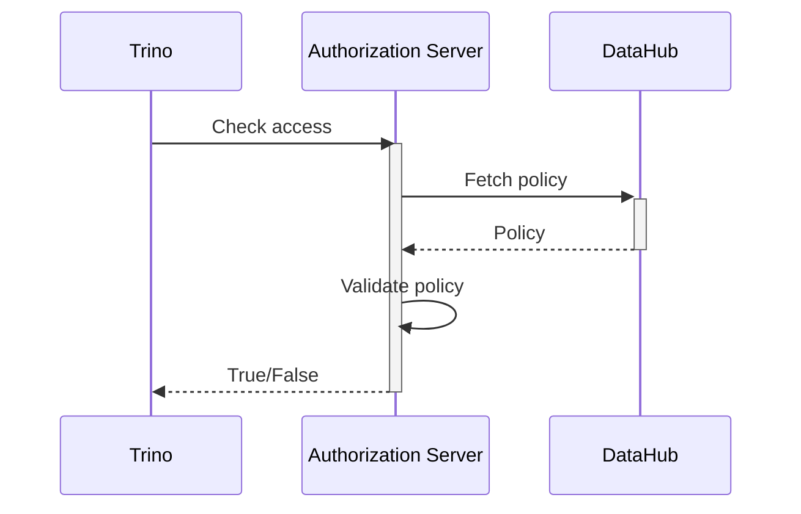

## Introduction

[Trino](https://trino.io) is a great distributed SQL query tool for querying and integrating data across multiple
data sources, and [DataHub](https://datahubproject.io) is a great metadata management platform. However, besides
DataHub being able to index and catalog metadata from Trino, the integration between these two platforms remain as that.

DataHub on its own provides tag and categorization metadata on its platform, alongside access policies to datasets
tagged with these metadata. However, these access policies set in DataHub is limited to only controlling access to 
dataset information on it. 

On the other hand, if you are using Hadoop, you will know that you can do tag based access control policies
through Apache Ranger and Apache Atlas, where access policies can be configured to Hive dataset based on tags 
tagged in Atlas. Trino supports Ranger and Atlas integration which can deliver similar capabilities, however, if
your preferred metadata management platform is DataHub, you do not have any option for tag based authorization 
using DataHub tags.

## Integrating Trino with DataHub

So what if you want to use DataHub for your access control policies, without having to dabble with the complexity
of Apache Ranger and Apache Atlas setup?. Trino have a hook you can utilize for this purpose, which is its 
[Open Policy Authorization](https://trino.io/docs/current/security/opa-access-control.html) plugin, which allows
you to point to a URL that validates whether user is allowed to access a particular resource or not. The URL simply
have to return following JSON, which Trino will use to allow or reject access to the resource:

```json
{
    "result": true
}
```

With this in mind, you can build an intermediary service for authorizing access 



Once you have your Authorization Server running, you can enable `trino-opa` plugin
with the endpoint that validates authorization.

## Other possibilities

As you would probably noticed by now, this strategy is quite generic. You can also
use this method to build/integrate whatever custom authorization engine you 
want for Trino. 

If you are looking for integrating your Trino authorization with Datahub and
does not want to go through the hassle of building the integration, do reach out
to me.

